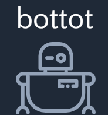
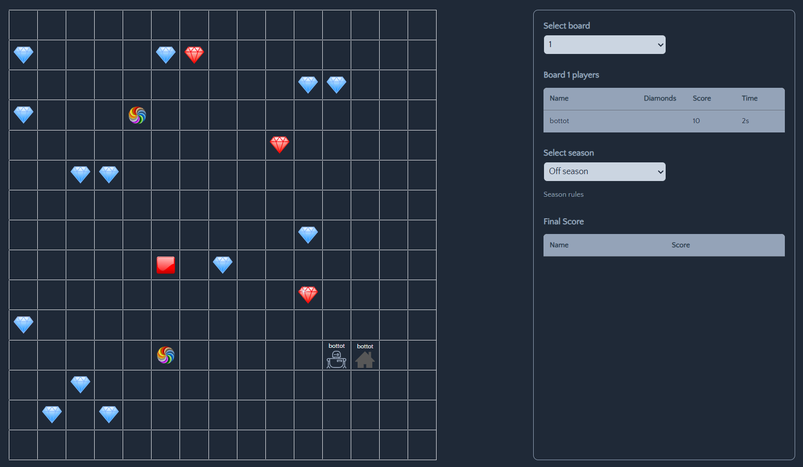
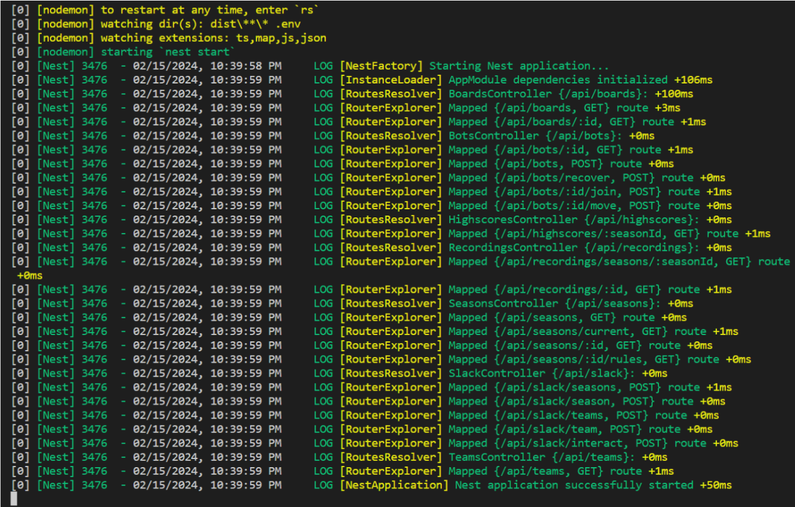
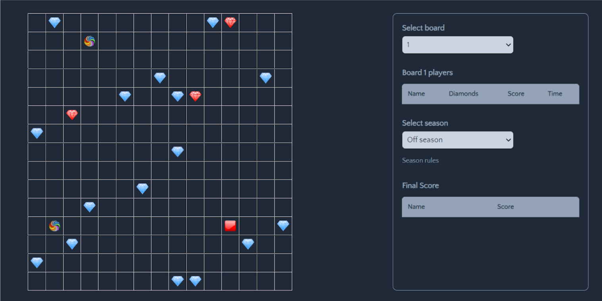
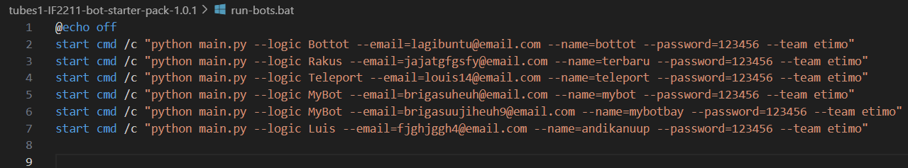
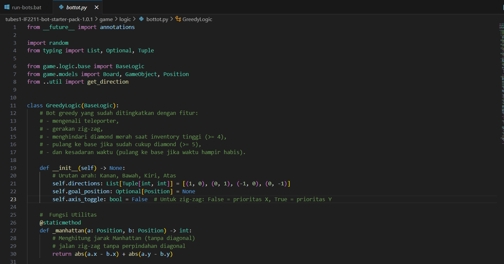
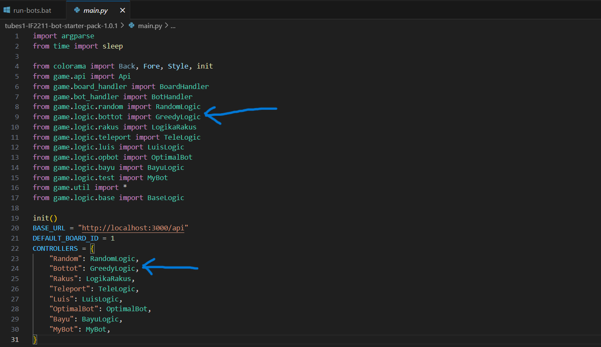
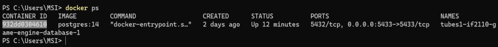

<h1 align="center">BOTTOT</h1>

 

# Table of Contents

[Description](#description)

[Requirements Program dan Instalasi](#requirements-program-dan-instalasi)

[Langkah-langkah](#langkah-langkah)

[Author](#author)

## Description
**BOTTOT** merupakan algoritma greedy yang cerdas dan adaptif, dirancang untuk mengumpulkan diamond secara efisien. Bot ini memprioritaskan diamond terdekat, menghindari diamond merah saat inventory ≥ 4, dan akan segera pulang ke base jika diamond sudah cukup (≥ 5) atau waktu hampir habis. Dengan dukungan strategi zig-zag, pemanfaatan teleporter, serta gerakan aman saat kondisi tidak ideal, BOTTOT mampu bergerak cepat dan efektif di berbagai situasi permainan.


## Requirements Program dan Instalasi
install program berikut
- [**Node.js**](https://nodejs.org/en)
- [**Docker Desktop**](https://www.docker.com/products/docker-desktop/)
- [**Python**](https://www.python.org/downloads/)
- **Yarn**  
  Run di terminal  
  ```
  npm install --global yarn
  ```

## Langkah-langkah
**1. Cara Menjalankan Game Engine**  
     Pastikan program dan instalasi sudah di install semua  
- **instalasi dan konfigurasi awal**  
1) Download source code (.zip) pada [**Game Engine**](tools/tubes1-IF2211-bot-starter-pack-1.0.1.zip)  
2) Extract zip tersebut, lalu masuk ke folder hasil extractnya dan buka terminal, disarankan pakai terminal vscode  
3) Masuk ke root directory dari project (sesuaikan dengan nama rilis terbaru)    
    ```
    cd tubes1-IF2110-game-engine-1.1.0
    ```  
4) Install dependencies menggunakan Yarn    
    ```
    yarn
    ```  
5) Setup default environment variable dengan menjalankan script berikut    
    Untuk Windows    
    ```
    ./scripts/copy-env.bat
    ```  
    Untuk Linux / (possibly) macOS    
    ```
    chmod +x ./scripts/copy-env.sh
    ./scripts/copy-env.sh
    ```  
6) Setup local database (buka aplikasi docker desktop terlebih dahulu, lalu jalankan command berikut di terminal)    
    ```
    docker compose up -d database
    ```  
    Lalu jalankan script berikut.     
    Untuk Windows  
    ```
    ./scripts/setup-db-prisma.bat
    ```  
    Untuk Linux / (possibly) macOS  
    ```  
    chmod +x ./scripts/setup-db-prisma.sh
    ./scripts/setup-db-prisma.sh
    ```  
- **Build**    
  ```
  npm run build
  ```
- **Run**
  ```
  npm run start
  ```
  Jika berhasil, tampilan terminal akan terlihat seperti gambar di bawah ini.
  
  Kunjungi frontend melalui http://localhost:8082/. Berikut adalah tampilan awal frontend.
  
  
  
**2. Cara menjalankan bot**  
     Pastikan Phyton sudah terinstall
- **instalasi dan konfigurasi awal**  
1) Download source code (.zip) pada [**Bot Starter Pack**](tools/tubes1-IF2211-game-engine-1.1.0.zip) 
2) Extract zip tersebut, lalu masuk ke folder hasil extractnya dan buka terminal, disarankan pakai terminal vscode  
3) Masuk ke root directory dari project (sesuaikan dengan nama rilis terbaru)    
    ```
    cd tubes1-IF2110-bot-starter-pack-1.0.1
    ```  
4) Install dependencies menggunakan pip    
    ```
    pip install -r requirements.txt
    ```  
- **Run**
  Untuk menjalankan satu bot (pada contoh ini, kita menjalankan satu bot dengan logic yang terdapat pada file game/logic/random.py)
  ```
  python main.py --logic Random --email=your_email@example.com --name=your_name --password=your_password --team etimo
  ```
  Untuk menjalankan beberapa bot sekaligus (pada contoh ini, kita menjalankan 4 bot dengan logic yang sama, yaitu game/logic/random.py)
  Untuk windows  
  ```
  ./run-bots.bat
  ```
  Untuk Linux / (possibly) macOS
  ```
  ./run-bots.sh
  ```
  Kalian dapat menyesuaikan script yang ada pada run-bots.bat atau run-bots.sh dari segi logic yang digunakan, email, nama, dan password
  

**Note:**  
1. Jika kalian menjalankan beberapa bot, pastikan setiap email dan nama unik
2. Email bisa apa saja asalkan mengikuti sintaks email yang benar, tidak harus email yang terdaftar (misal FajriBayu@email.com)
3. Nama dan password bisa apa saja tanpa spasi

**3. Cara mengimplementasikan bot**  
- Buatlah file(Logic) baru pada direktori /game/logic (misalnya bottot.py)
- Buatlah kelas yang meng-inherit kelas BaseLogic, lalu implementasikan constructor dan method next_move pada kelas tersebut  
  
**NOTE:** Next_move mengembalikan nilai delta_x dan delta_y, di mana nilai yang diperbolehkan hanyalah (1, 0), (0, 1), (-1, 0), (0, -1). Apabila nilai ilegal atau di-luar range board, maka move akan diabaikan oleh program  
- Import kelas yang telah dibuat pada main.py dan daftarkan pada dictionary CONTROLLERS
    
- Jalankan program seperti step c pada bagian 2 (sesuaikan argumen logic pada command/script tersebut menjadi nama bot yang telah terdaftar pada CONTROLLERS). Anda bisa menjalankan satu bot saja atau beberapa bot menggunakan .bat atau .sh script.   
    ```
    python main.py --logic Bottot --email=your_email@example.com --name=your_name --password=your_password --team etimo
    ```
**Note:**  
1. Kalian hanya boleh mengubah logic bot yang kalian buat saja (dalam contoh di atas adalah file mybot.py) dan main.py untuk mendaftarkan bot ke controller saja. Tidak diperbolehkan mengubah bagian lain (termasuk game engine), karena kalau rusak bakal repot sendiri.
2. Diperbolehkan membuat fungsi/kelas tambahan di dalam file yang sama dengan file kelas bot yang kalian buat (tidak di file lain, karena akan menyulitkan saat pelaksanaan kompetisi).
3. Tidak diperbolehkan menginstall package/library eksternal (misalnya package/library yang diinstall menggunakan pip install), karena akan menyulitkan saat pelaksanaan kompetisi. Silakan implementasikan sendiri atau gunakan library built-in seperlunya.  
- Beberapa konfigurasi permainan yang dapat diubah (do at your own risk)  
  **Note :** Hasil perubahan konfigurasi kalian tidak akan digunakan pada kompetisi. Kemungkinan besar kompetisi akan menggunakan konfigurasi default, namun jika ada perubahan akan diumumkan kemudian.  
- berikut cara meng-custom waktu bermain pada bot  
1) Nyalakan aplikasi docker desktop    
2) Temukan ID dari container yang menyimpan database  
   ```
   docker ps
   ```
   
3) Masuk ke terminal bash docker tersebut    
   ```
   docker exec -it 932dd0304610 bash
   ```
4) Buka PostgreSQL dengan command berikut
   ```
   psql -U diamonds -d diamonds -p 5433
   ```
5) Untuk menampilkan daftar tabel  
   ```
   \dt
   ```
6) Misalkan kalian ingin mengubah sessionLength menjadi 100 detik. Berikut caranya  
   ```
   UPDATE "BoardConfig" SET "sessionLength" = 100;
   ```
   Berikut adalah tabel BoardConfig setelah perubahan sessionLength (gambar sengaja dipotong agar muat di halaman)  
   ```
   SELECT * FROM "BoardConfig";
   ```

## Author

| Anggota | Nama | NIM | 
| --- | ---- | --- | 
| Ketua Kelompok | Muhammad Fajri Firdaus | 123140050 | 
| Anggota 1 | Bayu Brigas Novaldi | 123140030 | 


